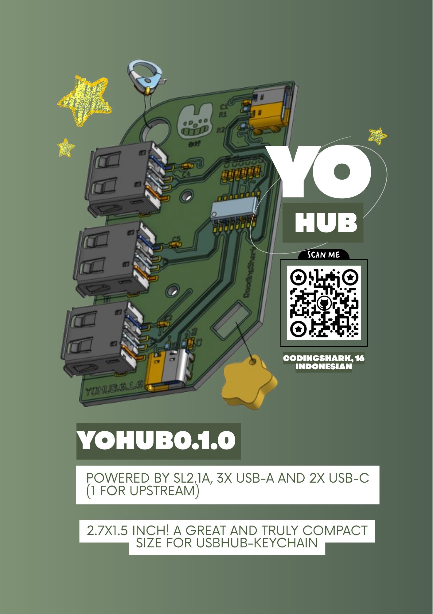
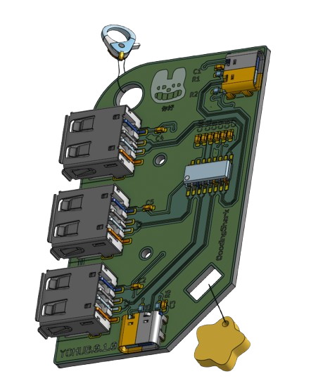
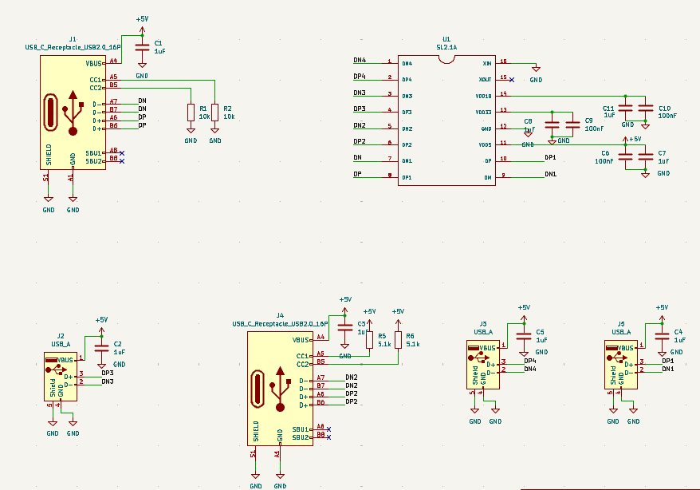
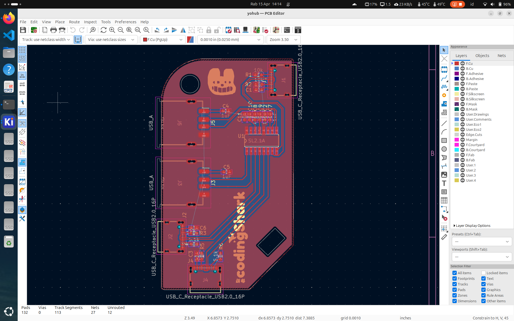

# YOHUB v0.1.0
meet YOHUBv0.1.0! a compact size dual function of hardware! aesthetic and usable as an USB HUB!
this USB hub was deisgned with kicad

## what is this?
keychain that you could use as an usual USB Hub, powered by SL2.1A! really compact and suitable for any bag ofc :3

here are some features of YOHUB v0.1.0

> 3x USB-A

> 1x USB-C

> 1x USB-c as upstream port

> keychain hole

> compact size! 6.8x3.8 (in cm)

## schema and pcb
here is the screenshot of schema and pcb editor

## components
Id,Designator,Footprint,Qty,Description,Supplier,Ref/Part Number,Price/Unit (IDR),Total (IDR)
1,"C2,C7,C5,C3,C4,C1,C11,C8",C_0603_1608,8,1uF Capacitor,LCSC,C15849,150,1.200
2,U1,SO16,1,SL2.1A (USB Hub IC),LCSC,C92463,4.500,4.500
3,"C10,C6,C9",C_0603_1608,3,100nF Capacitor,LCSC,C14663,100,300
4,"J1,J4",USB-C 16P,2,USB-C Female GCT,LCSC,C719112,3.500,7.000
5,"R2,R1",R_0603_1608,2,10k Resistor,LCSC,C25804,50,100
6,"R5,R6",R_0603_1608,2,5.1k Resistor,LCSC,C25905,50,100
7,"J3,J5,J2",USB_A_Rec,3,USB 2.0 Type A,LCSC,C51922,2.500,7.500
,,,,ESTIMASI TOTAL,,,,Rp20.

note: this is only the component not the pcb, we recommend to use JLCPCB

